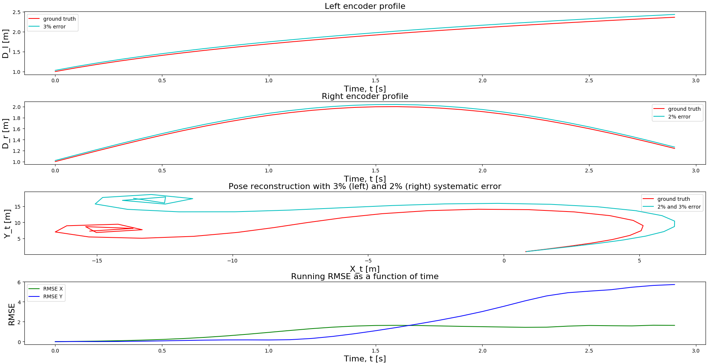
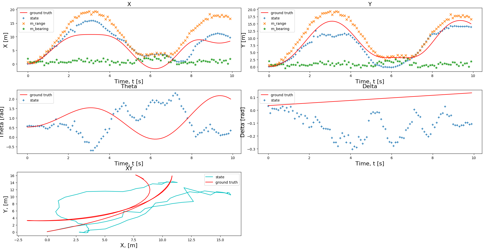
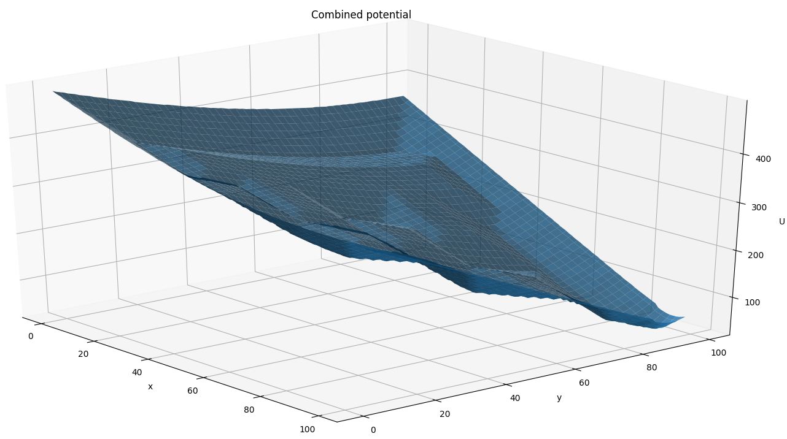
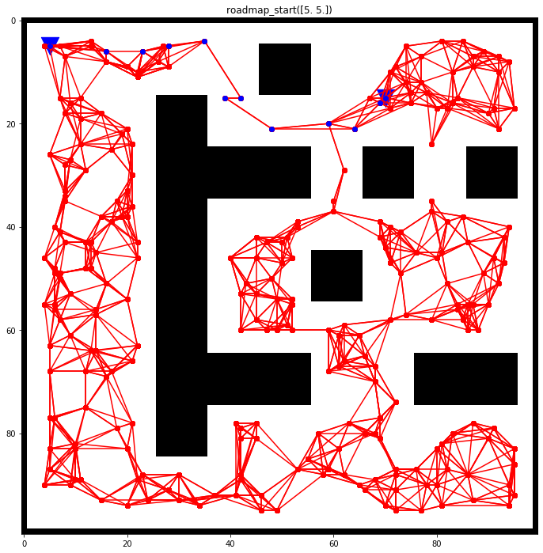
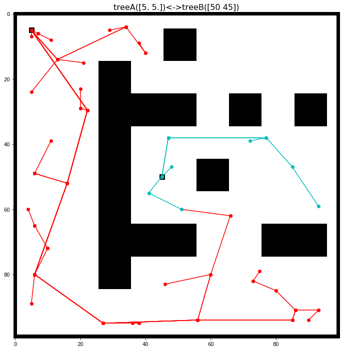

# misc-state-estimation
Various state estimation and path planning implementations for mobile robots in simulation

## Dead reckoning

## EKF

## Artificial potential fields

## Probabilistic roadmaps (PRM)

## RRT

